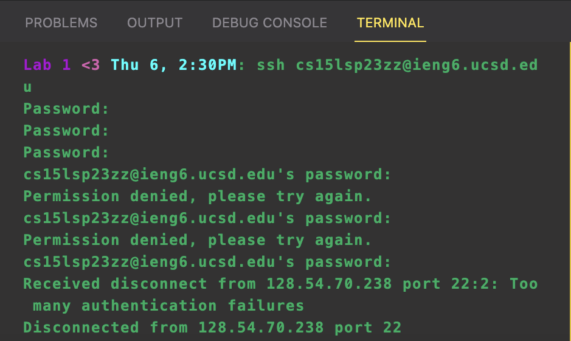

# Remote Access and FileSystem
*By: Madeleine Jimenez*

explanation about what report is about 

## Installing VScode

explain what you are doing here

**Installation**

* put description of what to do and how I skipped this step since you already downloaded it 

**Photo Examples**

* description

* explain the terminal too
include photo

## Remotely Connecting

**Password Reset**

explain what remotely connecting is/ begining steps of reseting pasdword 
include photos of reseting password add link of how to change password

**Connect to Account**

Show terminal of entering password and what you struggles with (password zz issue)
photo from doc 

* put the commands used when connecting and what shows up

## Trying Some Commands

explain what you are doing here

**Command Examples**
* explain what commands do
include photos of commands you used 
* go indepth on the comands 

