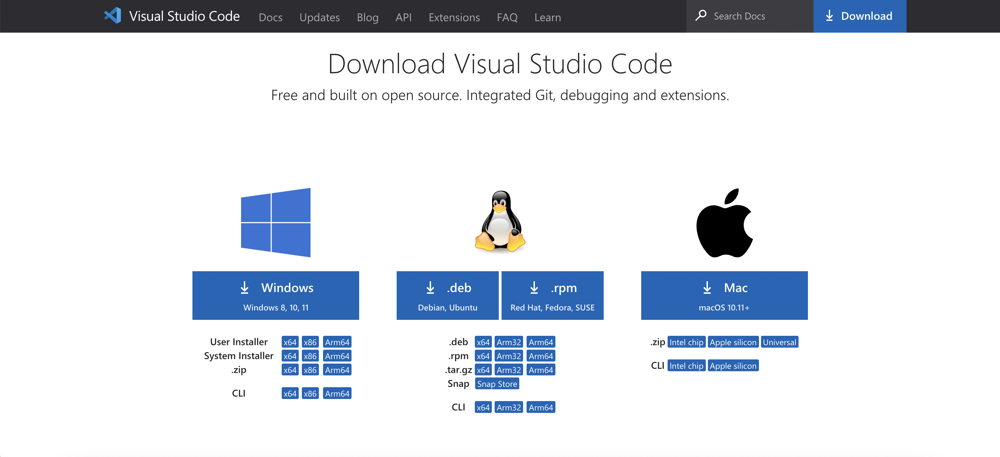
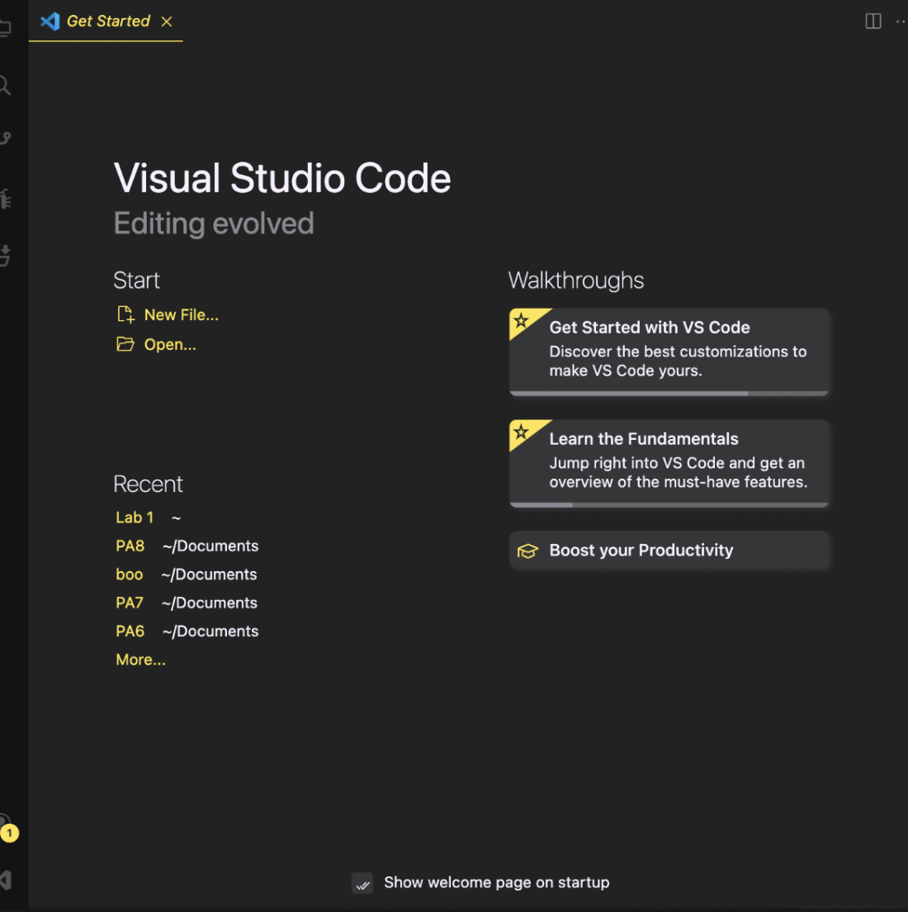
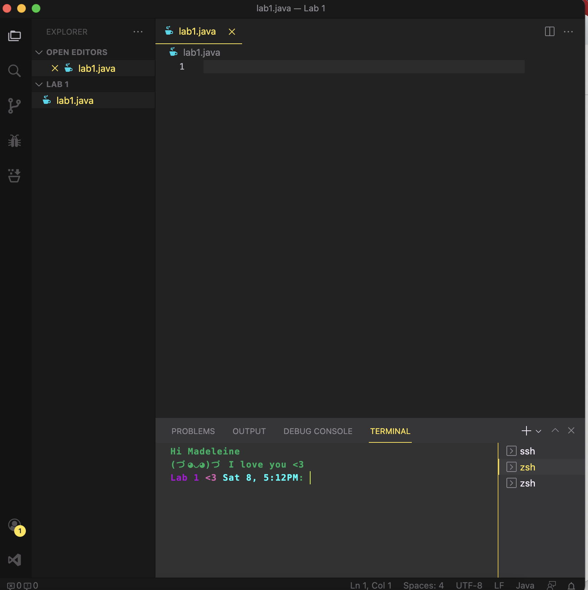
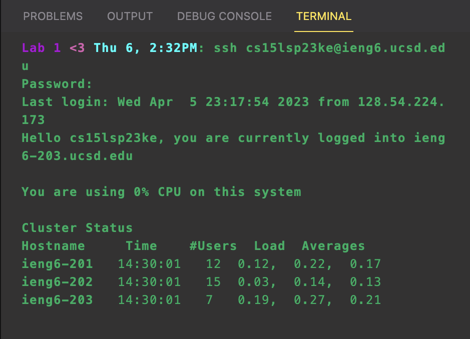
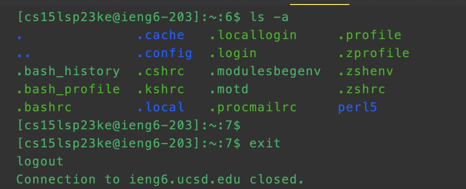
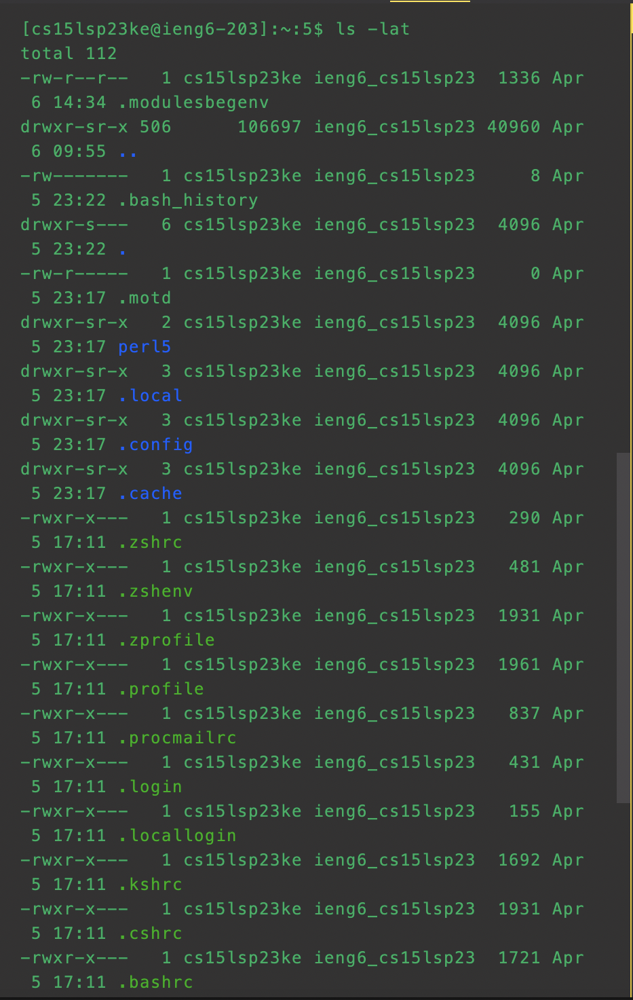

# Remote Access and FileSystem
*By: Madeleine Jimenez*

This report is a tutorial for incoming 15L students regarding how to log into a course-specific account on ieng6. 
I will go step by step on this tutorial, including photos to help visualize the steps. 
Thank you for reading my report. :D

## Installing VScode

To begin you must install Visual Studio Code (VScode), to do this you can go to this website: [VSCode Installer](https://code.visualstudio.com/Download). 

Photo included below of the page.

**Installation**

* On this page you select the correct version you need (Mac or Windows) and wait for it to open. 
* I already have VScode installed therefore I had no need to do this step. 

**Photo of VScode Beginning Page**

* This is a photo of how VScode should look once downloaded (It may look slightly different based on whether you use Mac or Windows, also mine is slightly personalized)

**Photo of File Open and Terminal**

**Again mine will look different as I personalized my terminal**
* From the beginning page you can create or select a file to start a project (I created a new file by the name of lab1)
* You can select the language you want to code in for the file (we are using java) and you can also open the terminal to start your commands 

## Remotely Connecting

After setting up VScode you are now ready to connect remotely. To begin you must reset your password using the tutorial that was provided here: [Password Reset Instructions](https://drive.google.com/file/d/17IDZn8Qq7Q0RkYMxdiIR0o6HJ3B5YqSW/view).

**Connect to Account**
* In order to connect you must begin by inputing this command into your terminal `ssh cs15lsp23zz@ieng6.ucsd.edu`
**Make sure to replace the `zz` within the command to your personal letters for your account**

* After inputting this command you should get a message like this:
 
`The authenticity of host 'ieng6.ucsd.edu (128.54.70.227)' can't be established.
RSA key fingerprint is SHA256:ksruYwhnYH+sySHnHAtLUHngrPEyZTDl/1x99wUQcec.
Are you sure you want to continue connecting (yes/no/[fingerprint])? `

* Respond in the terminal with `yes`
* After inputing yes you will be asked to input your passsword (the password you reset previously)
* You must input your pasword correctly multiple times before it will log you in.
**When inputing your password it will not show what you type into the terminal but what you type is being registered** 

* In the photo below is an example of how it lookes after you have correctly input your password and logged in

## Trying Some Commands

**Command Examples**

In the Images above I used two different commands:
* ls -lat
* ls -a

**Command Explanation**
* The command `ls -lat` shows the current directory contents, files and some other miscellaneous information along with timestamps for when they were used.
* The command `ls -a` is similar to the previous command, it shows the current directory contents and hidden files but does not give timestamps for when used.

## All Done

You have now completed all the steps, this means you were able to download VScode, create a file, connect remotely through the terminal and even use a few commands. GOOD JOB!!! 
