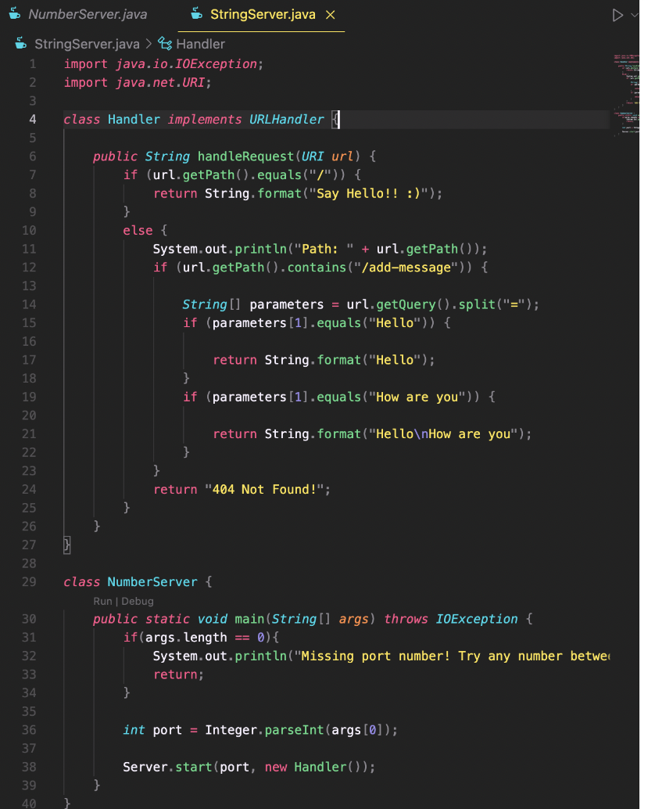

# Lab Report 2 - Servers and Bugs
*By: Madeleine Jimenez*

//explain report

## Part 1 - StringServer

Included below are pictures of my code for StringServer and the output for both `/add-message?s=Hello` and `/add-message?s=How are you`

**Description for `/add-message?s=Hello`**
* Which methods in your code are called?
    
* What are the relevant arguments to those methods, and the values of any relevant fields of the class?
* How do the values of any relevant fields of the class change from this specific request? If no values got changed, explain why.

**Description for `/add-message?s=How are you`**
* Which methods in your code are called?
* What are the relevant arguments to those methods, and the values of any relevant fields of the class?
* How do the values of any relevant fields of the class change from this specific request? If no values got changed, explain why.

## Part 2 - One Bug From Lab

## Part 3 - What I learned 

