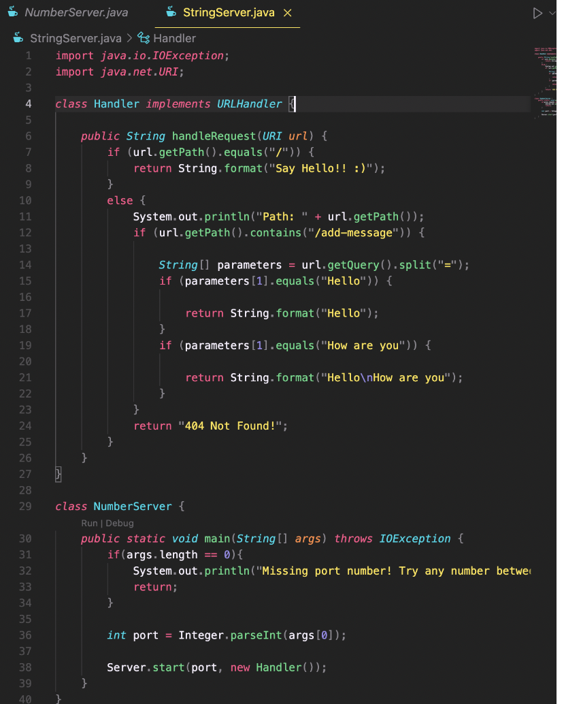
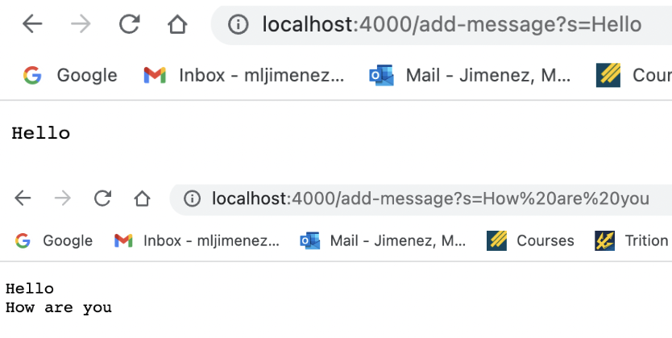
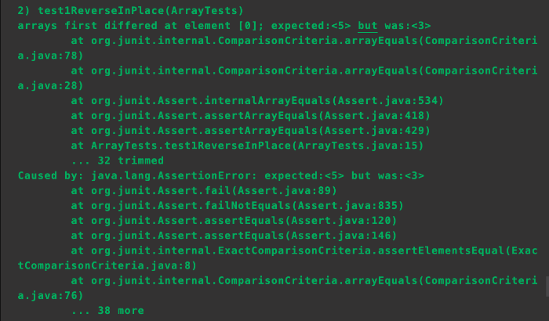

# Lab Report 2 - Servers and Bugs
*By: Madeleine Jimenez*

This report has three parts:
* In the first part I explain a server that I created called StringServer that adds the messages Hello and How are you. 
* In the second part I go in-depth on a bug from the lab 3 buggy programs.
* In the third part I go over what I learned overall

Thank you for taking the time to read my report and I hope you have a good day! :)
Now on to the report!

## Part 1 - StringServer

Included below are pictures of my code for StringServer and the output for both `/add-message?s=Hello` and `/add-message?s=How are you`




**Description for `/add-message?s=Hello`**
* Which methods in your code are called?

    The method that is called is handleRequest, this is inside of the class Handler which implements URLHandler.
    
* What are the relevant arguments to those methods, and the values of any relevant fields of the class?

    The relevant argument for handleRequest is URI url and the values of some relevant fields of the class include "/", "/add-message", "Hello", "How are you", "404       not found", "=".
    
* How do the values of any relevant fields of the class change from this specific request? If no values got changed, explain why.

    The values change based on what output is needed. SOme values that I changed include "add-message", "Hello", and "How are you", these values were included to           change the output to hello and how are you when add-message was added to the URL. Without these values being chnaged the coutput would not be the same, the values     that did not change include the error message, "=", and "/", these did not change as they are values that apply to most URLs. 

**Description for `/add-message?s=How are you`**
* Which methods in your code are called?

    The method that is called is handleRequest, this is inside of the class Handler which implements URLHandler.
    
* What are the relevant arguments to those methods, and the values of any relevant fields of the class?

    The relevant argument for handleRequest is URI url and the values of some relevant fields of the class include "/", "/add-message", "Hello", "How are you", "404       not found", "=".
    
* How do the values of any relevant fields of the class change from this specific request? If no values got changed, explain why.

    The values change based on what output is needed. SOme values that I changed include "add-message", "Hello", and "How are you", these values were included to           change the output to hello and how are you when add-message was added to the URL. Without these values being chnaged the coutput would not be the same, the values     that did not change include the error message, "=", and "/", these did not change as they are values that apply to most URLs. 

## Part 2 - One Bug From Lab

The bug I will be explaining is the **reverseInPlace** bug in ArrayExamples.java.

* A failure-inducing input for the buggy program, as a JUnit test and any associated code 
 
```
int [] input1 = {3, 4, 5};
ArrayExamples.reverseInPlace(input1);
assertArrayEquals(new int[]{5, 4, 3}, input1);
```

* An input that doesn’t induce a failure, as a JUnit test and any associated code 

```
int [] input1 = {3};
ArrayExamples.reverseInPlace(input1);
assertArrayEquals(new int[]{3}, input1);
```

* The symptom, as the output of running the tests (provide it as a screenshot of running JUnit with at least the two inputs above)


**The other test passes regardless if code is bugged or not**
* The bug, as the before-and-after code change required to fix it 
 
**Before**

```
static void reverseInPlace(int[] arr) {
    for(int i = 0; i < arr.length; i += 1) {
      arr[i] = arr[arr.length - i - 1];    
    }
```
    
**After**

```
static void reverseInPlace(int[] arr) 
    int temp_arr;
    for(int i = 0; i < arr.length/2; i += 1) {
        temp_arr = arr[i];
        arr[i] = arr[arr.length - i - 1];
        arr[arr.length - i - 1] = temp_arr; 
    }
```    

* Briefly describe why the fix addresses the issue.

The fix address the issue as it flips the array when you use a temp, originally it did not flip the array. The temp stores the original value and then the reversed value is set to equal the temp effectively reversing it. 

## Part 3 - What I learned 

Something that I learned from lab in week 2 that I didn't know was URLs and their different ways of being used. ALso how they are managed, such as how a google search changes the URL. I was able to how to create a server and implement the uses of paths/queries. I have really been enjoying this class so far and have been able to learn many things I did not know regarding java such as certain commands as well. Thank you for all the hard work you guys are doing, making this an amazing class that I am glad to be apart of!

