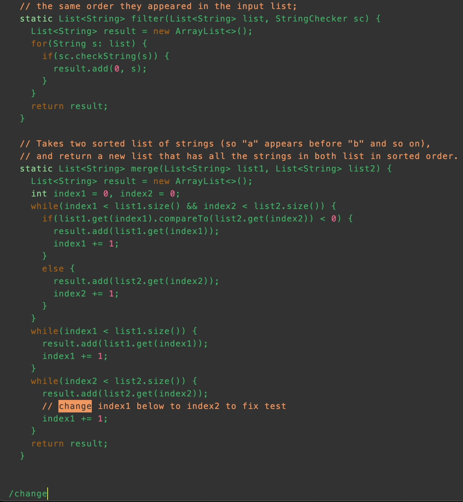

# Lab Report 4
*By: Madeleine Jimenez*

In this lab report I will be reproducing and showing how to do the following tasks:

Step 1: Log into ieng6

Step 2: Clone your fork of the repository from your Github account

Step 3: Run the tests, demonstrating that they fail

Step 4: Edit the code file to fix the failing test

Step 5: Run the tests, demonstrating that they now succeed

Step 6: Commit and push the resulting change to your Github account

Thank you for taking the time to read my lab report!

## Step 1

*To log on to ieng6 I use the command `ssh cs15lsp23zz@ieng6.ucsd.edu` in the terminal. Here is a photo.*


**Keys used**
* For this step the keys I used was `<enter>` after typing the command `ssh cs15lsp23zz@ieng6.ucsd.edu` this allows 
the command to pass. 

## Step 2

*To clone the fork you enter `git clone <repository>`, as demonstrated below.*


**Keys used**
* For this step the only key I used was `<enter>`, it was used after inputing into the terminal `git clone <repository>`, this allows the
command to pass.

## Step 3

*Before this step it is important to cd to the repository `cd lab7`, this is to be able to acess the tests within the repository.
After you can run the tests using the command `bash test.sh` to see the test fails, as show in the image below.*


**Keys used**
* For this step the only key used was `<enter>` twice, first after inputing the command `cd lab7` and second when inputing `bash test.sh`.
* This allows both commands to pass.

## Step 4

*To edit the code file you start by using this command in the terminal `vim ListExamples.java`. After using this command the file should 
appear on vim, where you can edit the file to change index1 to index2. See the images below.*





**Keys used**
* For this step the keys used are `<enter>` after inputing the command `vim ListExamples.java`, this allows the command to pass. 
* Once in vim the keys I used are as follows:
```
/change <enter> <down> <right> <right> x i <2> <escape> :wq <enter>
```
* `/change` works like CTRL-f and takes you directly to the word change in the file, pressing `<enter>` brings your cursor to the beginning of the word, after go `<down>`, `<right>` twice and your cursor will be infront of the number you need to change. By pressing `x` you delete 1 and `i` changes the mode to insert where you can change the file, pressing `<2>` adds `<2>` to make index2. Once you press `<escape>` you go back to normal mode type `:wq` to save and quit, pressing `<enter>` to finish.
* This is shown in the images above

## Step 5

*This step is simliar to step 3, in order to check run the test again you use `bash test.sh`. 
 In the image below you can see the output you should get after completing step 4.*


**Keys used**
For this step the only key used was `<enter>`, after inputing the command `bash test.sh`, this allows the command to pass.

## Step 6

*For this step to commit the changes made you use the command `git commit ListExamples.java`.
Once you have entered this command you can add any message before committing, I added `<small change>`. 
After this is done use the command `git push` and then you are done! Use the photos below as reference.*


**Keys used**
* In this step I used `<enter>` after using `git commit ListExamples.java`, allowing the command to pass. Once in the commit page I used the following keys 
```
i <small change> <escape> :wq <enter>
```
* `i` converts the mode to insert mode where you can edit. I edit by adding the words `<small change>`, `<escape>` then pulls you out of insert mode back to normal mode, `:wq` then saves and quits after pressing `<enter>`.
* After I used `git push` and used `<enter>` to execute the command.
  
## All Done

Thank you again for reading my lab report! I hope you have a good rest of your day! :)
