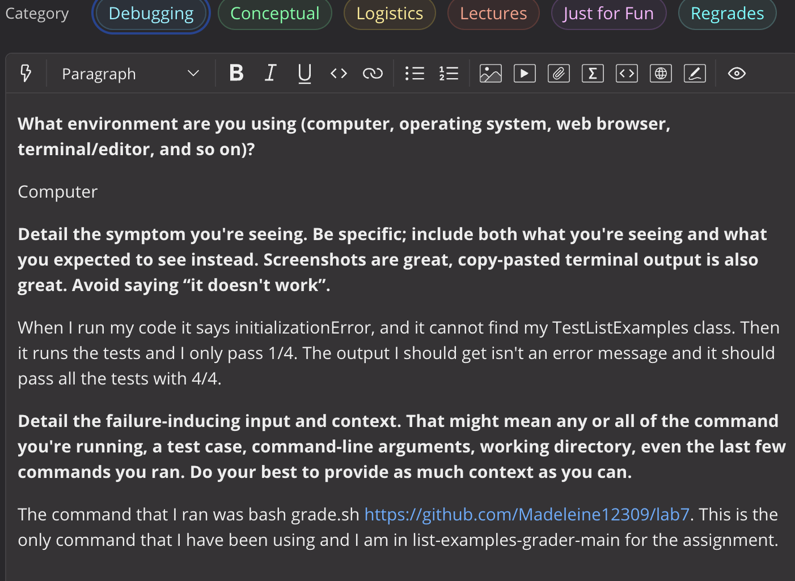
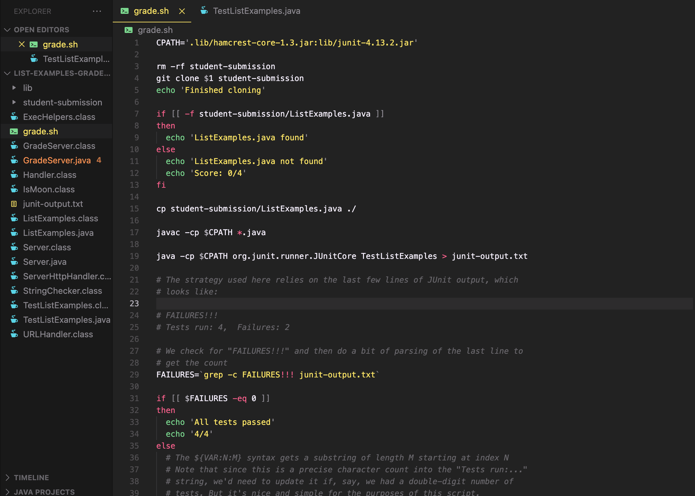
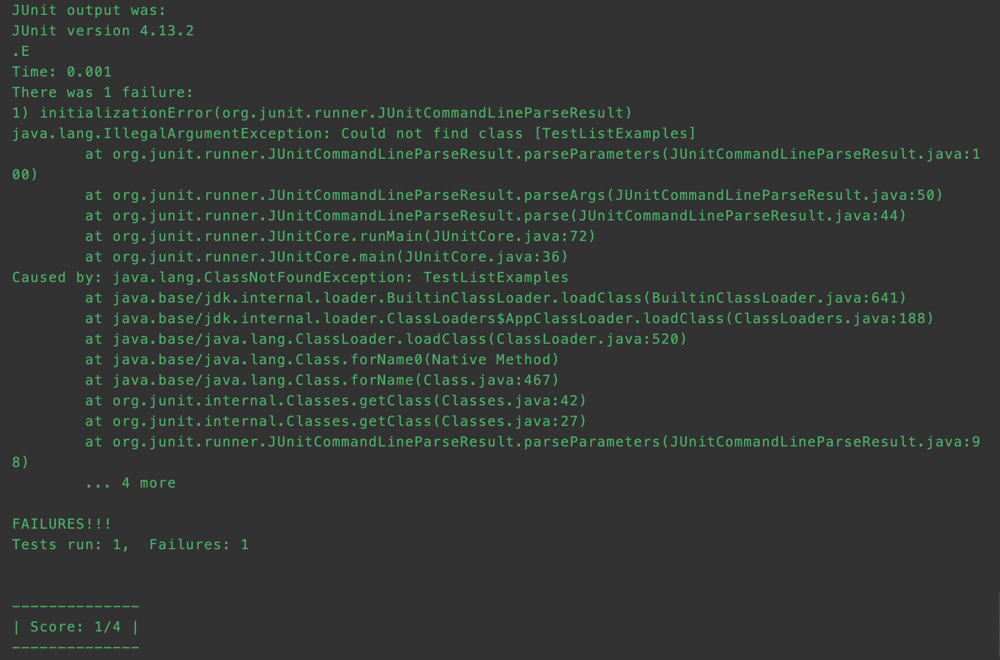
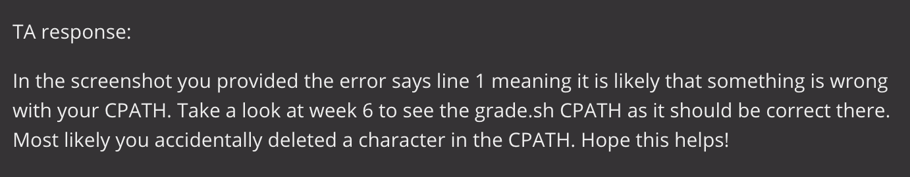
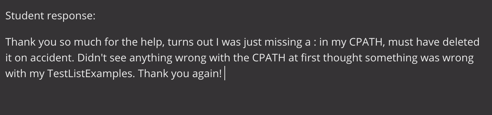
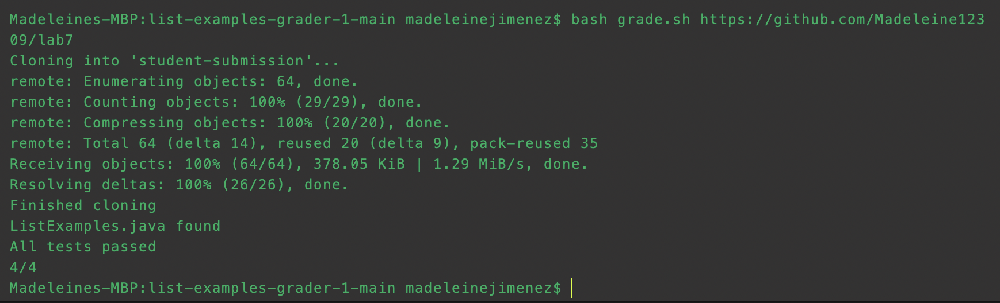
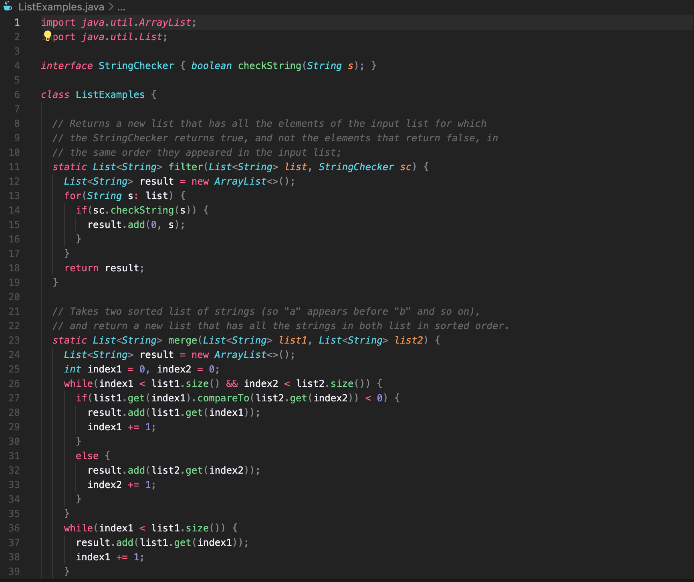
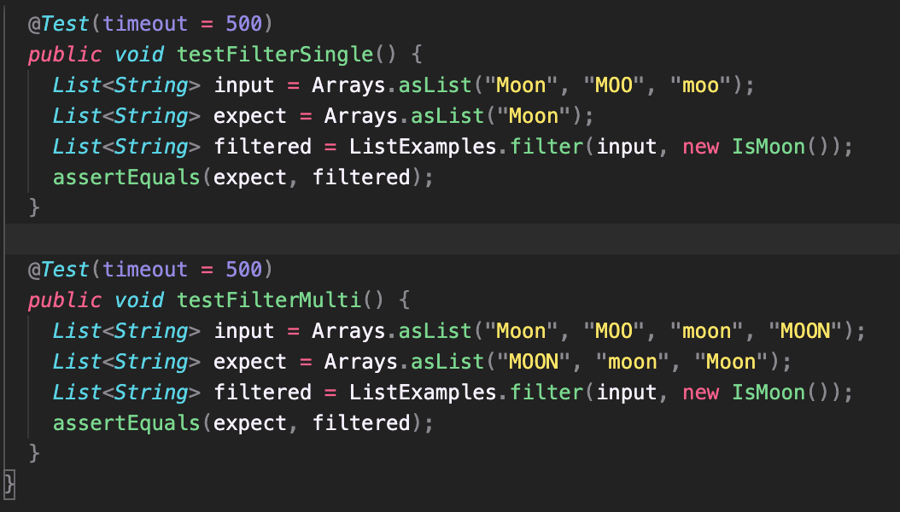
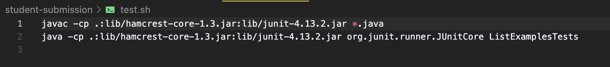

# Lab Report 5 Debugging Scenario
*By: Madeleine Jimenez*

In this lab report I will be demonstrating a debugging scenario where I play the role of a student who has an error in their code posting on edstem in order to get help from a TA to fix the error. I will also act as the TA responding to the student who needs help, providing them with an answer. Thank you for reading my last lab! :)

# Part 1 – Debugging Scenario

## Original Post

*Below is the post the student on edstem, a screenshot of their code, and their terminal that is producing the failure output. In the report they explain what they see and what command they used.*




* As seen in the screenshots above the student acknowledges that there is an InitializationError in their code where it cannot find the class TestListExamples. The student is confused as to what can be the cause of this error and seeks help. 

## TA Response

*Below is the TA's response to the student asking for help, they are able to help them find the error.*


* The TA finds that the error message in the terminal is from line 1 meaning it is likely that something is wrong in the CPATH and recommends to the student to look at a previous week to make sure their CPATH is correct.

## Student Final Response 

*Below is the students final response to the TA where they have foudn the error and provide a screenshot with the terminal printing the correct message.*




* The student finds that the error they had was simply a `:` they missed in the CPATH as the second character.

## Setup Information 

* The file & directory structure needed
- The files used in this assignment were:
- `grade.sh`
- `ListExamples.java` 
- `TestListExamples
- `student-submission`
- `junit`
- The directory I used was:
- `list-examples-grader-1-main`
* The contents of each file before fixing the bug

- `grade.sh`

- `ListExamples.java` 

- `TestListExamples`

- `student-submission` This can be found in student-submission

- `junit` This is where junit is used, it is found in student-submission
* The full command line (or lines) you ran to trigger the bug
- The full command line that was used was:
```
bash grade.sh https://github.com/Madeleine12309/lab7
```
*A description of what to edit to fix the bug
- In order to fix the bug all that was needed was a `:` in the second character of the CPATH
- The correct CPATH: `.:lib/hamcrest-core-1.3.jar:lib/junit-4.13.2.jar`
- The incorrect CPATH: `.lib/hamcrest-core-1.3.jar:lib/junit-4.13.2.jar`


## Part 2 – Reflection

*For my reflection something that I learned that I did not know previously was all the technical command such as grep and the different ways to use find. I was also able to learn about the properties of vim and how to alter a file then push it to git. I was able to learn many different, new things during the quarter and had fun learning with my lab group. I will miss this class as I had fun and enjoyed lab every week.*

Thank you for taking the time to read each and every one of our reports and thank you for a great quarter! Have a great summer! :)

